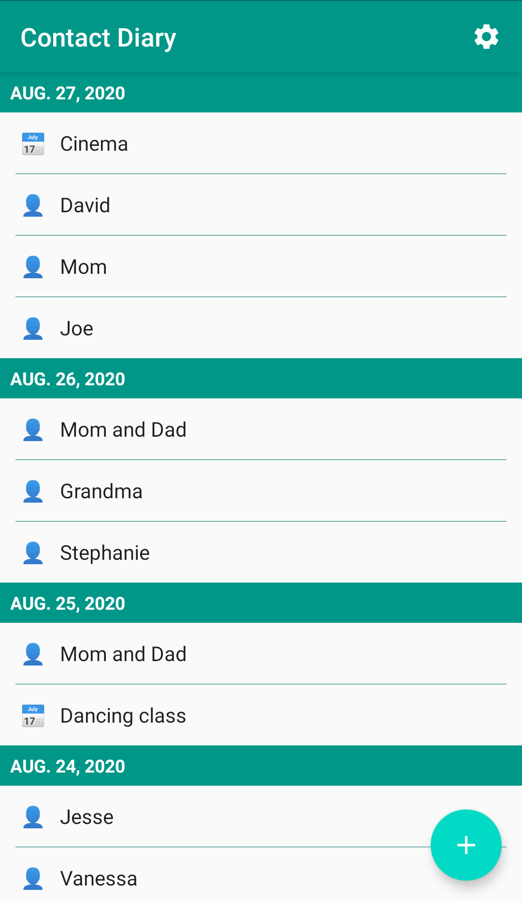

&nbsp;  &nbsp;Contact Diary
=========

Open-source app to keep track of the people you have recently been with

 

Be aware that this version, while it matches that on Google Play, doesn't support automatic updates.

# Summary :clipboard:

Contact Diary is a simple app that allows you to keep a record of the people you have met and the events you have attended to recently. In the undesired event that you test positive for COVID-19, Contact Diary is a place where to quickly find who you must warn about the situation.

# How it works :hammer:
Every day Contact Diary will prompt you to insert the events you have attended and the people you have been with during the day. Through some simple forms you will be able to store the essential information about your contacts, in case you need to retrieve it. Just that. Simple, right? ;)

# Features :zap:
- Configurable notification time, so the prompt does not interfere with your daily workflow.
- Show only potentially risky contacts.
- Automatic removal of entries older than 15 days.
- JUST ONE PERMISSION, that needed for the app being able to notify you after device restarts. Nothing else.
- In particular, NO INTERNET permission. The information entered is yours, and it never leaves your device.

# Privacy :lock:
This app has no ads and requests no unnecessary permissions.

Contact Diary doesn't send any data to a cloud and not having permission to access the internet is a strong guarantee of that.

# Questions & Issues :thinking:

- Wait, isn't this what Governments' contact tracing apps are doing?
No. The goals of Governments' contact tracing apps and of Contact Diary are inherently different. Governments' contact tracing apps _notify you_ when you have been at risk, and Contact Diary serves to remember who _you must notify_ if you test positive.

- Is this app BETTER than Governments' contact tracing apps?
No. Governments' contact tracing apps may account for contacts that you may not be aware of, like the person sitting in a neighboring table at a restaurant, or that other person using the same bus to go to work. Contact Diary IS NOT A REPLACEMENT TO GOVERNMENTS' CONTACT TRACING APPS.

- Is this app WORSE than Governments' contact tracing apps?
No. Government's contact tracing apps crucially rely on all persons interacting to have the app in order to do proper notifications. With Contact Diary, you just need yourself to keep track, and you can easily notify people (or places) that do not use conventional contact tracing apps.

- Will this app share the information I input?
NO. The app has no permissions other than that necessary for the notification system. In particular, there is no way that it can connect to the internet. The information you insert will never leave your device. Even more, entries in the diary are automatically eliminated when they become older than 15 days.

If you still haven't found an answer, please create a [new issue](https://github.com/apozas/contactdiary/issues/new/choose) on GitHub.

# Donations :heart:

If you would like to support this project's further development, the creator of this project or the continuous maintenance of this project, feel free to donate. Your donation is highly appreciated. Thank you!

# Contributing :+1:

If you found a bug, have an idea how to improve the Contact Diary app or have a question, please create a [new issue](https://github.com/apozas/contactdiary/issues/new/choose) or comment an existing one. If you would like to contribute code, fork the repository and send a pull request.

_Translations:_

You can translate the in-app texts of Contact Diary on [Crowdin](https://crwd.in/contactdiary). If your language is not listed, please please create a [new issue](https://github.com/apozas/contactdiary/issues/new/choose) on GitHub, or [send me an email](mailto:contactdiary@alexpozas.com).

# Screenshots :eyes:

<table>
  <tr>
    <th>
        
    </th>
    <th>
        
    </th>
    <th>
        
    </th>
    <th>
        
    </th>
  </tr>
</table>

# License :page_facing_up:

Contact Diary is licensed under the GPL v3, see LICENSE file for full notice.

    Copyright (C) 2020  Alex Pozas-Kerstjens <alex@alexpozas.com>
    
    This program is free software: you can redistribute it and/or modify
    it under the terms of the GNU General Public License as published by
    the Free Software Foundation, either version 3 of the License, or
    (at your option) any later version.

    This program is distributed in the hope that it will be useful,
    but WITHOUT ANY WARRANTY; without even the implied warranty of
    MERCHANTABILITY or FITNESS FOR A PARTICULAR PURPOSE.  See the
    GNU General Public License for more details.

    You should have received a copy of the GNU General Public License
    along with this program.  If not, see <http://www.gnu.org/licenses/>

# Thanks :thumbsup:

Incredible thanks to [openScale](https://github.com/oliexdev/openScale), [FairEmail](https://github.com/M66B/FairEmail/), [pildorasinformaticas](https://www.youtube.com/channel/UCdulIs-x_xrRd1ezwJZR9ww), [Prabeesh R K](https://www.youtube.com/channel/UCfQkNueQenRQQ1NnCBe6eQQ) and, of course, the [StackOverflow community](https://www.stackoverflow.com). Without them, this project would have never been realized.	
